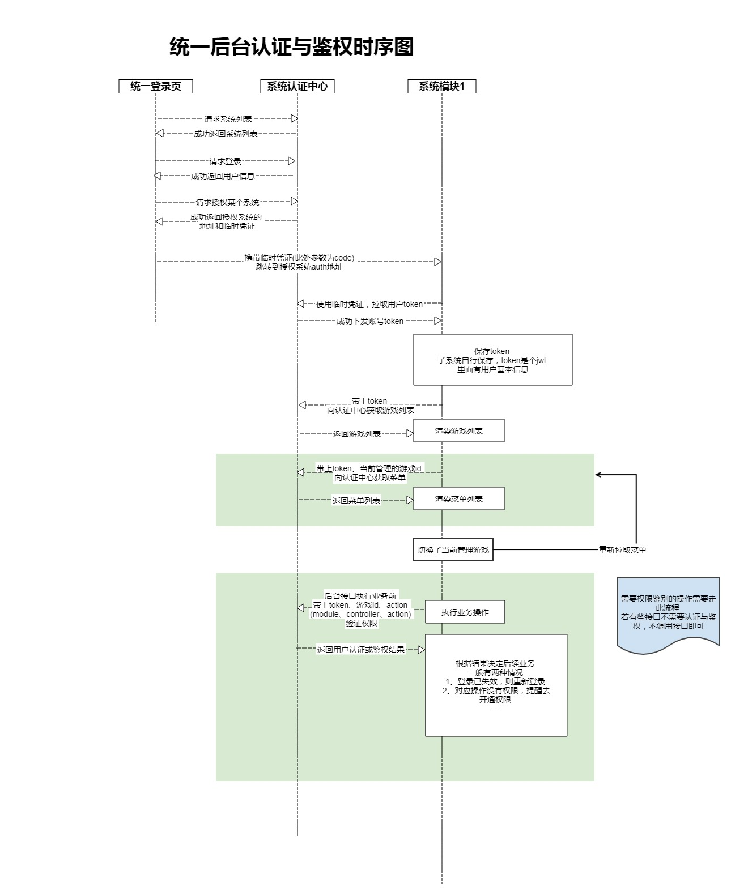

# 统一后台接入示例

> 统一后台提供了，统一的用户认证和鉴权能力。

管理功能主要包括：

- 用户管理(包括域账号/普通账号/常州域账号)
- 权限管理
- 菜单管理
- 角色管理
- 游戏管理

### 接入方式
- 一种是对于新系统可以直接使用下方提供的后台demo，直接写业务代码即可。[详细使用](./copy_from_demo.md)
- 一种是老后台系统，可以根据对接协议，接入即可。[详细使用](./docking_by_agreement.md)

统一后台各终端调用时序图：

